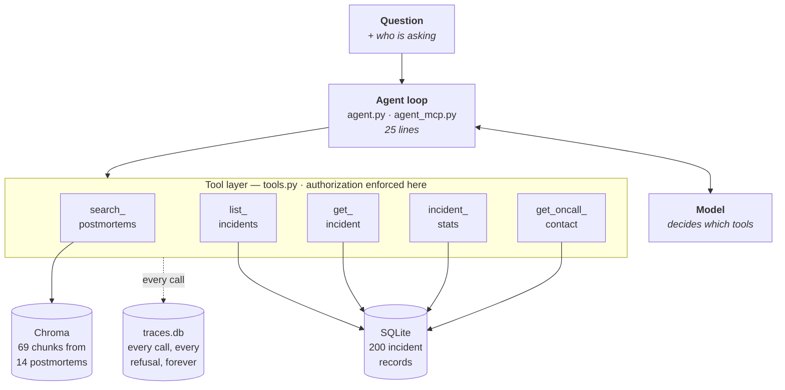
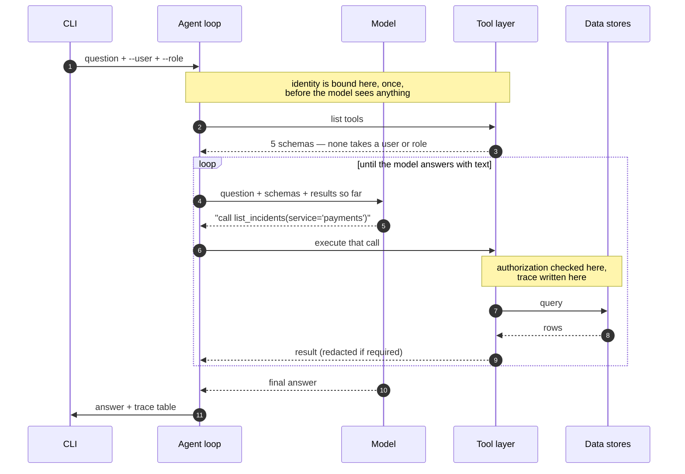

# Incident Response Agent


**Building the agent took an afternoon. Everything around it took the rest of the time, and that part is the point.**

An agent that answers questions about production incidents by reading across two kinds of data at once: 200 structured incident records and 14 written postmortems. It runs locally on synthetic data, with no cloud account and no framework.

The incident domain is a vehicle. What the repo is actually about is the harness around the model — retrieval, tool design, authorization, and tracing which is where the engineering turned out to live.

## Quick start

Python 3.10+ and an Anthropic API key.

```bash
git clone https://github.com/pzinzuvadia/incident-response-agent.git
cd incident-response-agent
```
```bash
python3 -m venv .venv && source .venv/bin/activate
pip install -r requirements.txt
cp .env.example .env                    # add ANTHROPIC_API_KEY

python generate_data.py                 # 200 incidents → SQLite
python src/ingest.py                    # 14 postmortems → vector store
python src/agent.py "We're seeing payment timeouts again. Has this happened before, and who should I call?" --trace
```

First run of `ingest.py` downloads an ~80MB embedding model. Detailed setup is in [§5](#).

## What that produces

```
Q [p.zinzuvadia / engineer]: We're seeing payment timeouts again.
Has this happened before, and who should I call?

Yes — this is a recurring failure mode in payments, not a new problem.

- INC-0020 (Nov 14, 2025, Sev-3) — connection pool sized for traffic from
  18 months prior, couldn't handle morning peak.
- INC-0076 (Jan 29, 2026, Sev-2) — p99 degraded to 6s. Same failure mode.
- INC-0100 (Mar 18, 2026, Sev-1) — ~4,100 checkouts failed. Third
  occurrence of the same mode.
- INC-0144 (Jun 3, 2026, Sev-2) — driver version bump changed idle timeout
  defaults, shrinking the effective pool over time.
- INC-0187 (Aug 21, 2026, Sev-2) — request queueing under sustained traffic.

From the INC-0100 postmortem: "Holding a connection while waiting on a
third party is the actual anti-pattern here. The timeout you set on an
external call is also, implicitly, a decision about how long you are
willing to hold every resource behind it."

[...]

Who to call: Payments Platform — Dana Whitfield, +1-415-555-0142

==============================================================================
TRACE
==============================================================================
#   TOOL                 USER            OUTCOME        MS  ARGUMENTS
---------------------------------------------------------------------------
1   search_postmortems   p.zinzuvadia    ok          363.6  query='payment timeouts', service='payments'
    └─ 10 chunk(s) from 4 postmortem(s)
2   list_incidents       p.zinzuvadia    ok            3.7  service='payments'
    └─ 48 incident(s)
3   get_oncall_contact   p.zinzuvadia    ok            0.1  service='payments'
    └─ Payments Platform / Dana Whitfield
---------------------------------------------------------------------------
3 tool call(s), 367.4 ms total in tools
```

Three things in that output are worth noticing before anything else.

**It found a ten-month pattern that no single document states.** Those five incidents were written months apart by different people, and none of them mention "connection pool" in a title or summary. That is a property of how the documents were chunked at ingestion, not of how the question was phrased.

**Retrieval only reached four of the five.** The fifth incident got into the answer through `list_incidents`, not through search. Giving the agent both a retrieval tool and a query tool means retrieval does not have to be perfect.

**The same question from a contractor returns the same history and no phone number.** The refusal happens inside the tool, not in the prompt. That one is the longest section of this README.


## The agent is the easy part

The loop in this repo is about few lines. Send the question and the tool schemas to a model, run whatever tool it asks for, send the result back, repeat until it answers with text instead of another tool call. That is the entire agent, and it is the least interesting file here.

The hard part starts the moment that loop points at data that matters.

Can it reach records this particular person should not see? When the answer is wrong, can you tell whether it retrieved badly or reasoned badly? What happens when a contractor asks the same question an engineer just asked? Three weeks from now, when someone disputes an answer, can you reconstruct what it actually did?

None of those are model problems. They are problems with everything around the model, how knowledge gets into the system, what the agent is allowed to touch, who is asking, and what gets written down. That layer is where the real work is, and it is the part most agent examples skip, because a demo does not need it and a deployment does not survive without it.

This repo is a working instance of that layer. Four decisions carry almost all of it.

### Retrieval quality is decided at ingestion, not at query time

When retrieval underperforms, the instinct is to tune the query, raise `top_k`, or swap the embedding model. Usually the damage was done earlier, when documents were split into chunks that lost the context they needed to be found. By the time you are tuning a query, you are working around a decision you already made.

### Tool descriptions are documentation with a non-human reader

A tool description is not a comment. It is the only interface the model has when it decides what to call, and it is read literally — including numbers mentioned in passing, which the model will pass as arguments. Vague descriptions do not produce a confused user. They produce a wrong tool call and therefore a wrong answer.

### Authorization belongs in the tool, not the prompt

You cannot ask a model nicely to keep a secret. An instruction in a system prompt is not a security control, it is a suggestion to a probabilistic text generator, and it degrades under paraphrase and long context. Restricting the agent to a fixed set of tools helps, but it answers a different question: *what can this agent ever do*, rather than *what may this person see right now*.

### Monitoring tells you the service is up. It does not tell you what the agent did.

Standard observability answers: did it respond, how fast, did it error. Every one of those can be green while the answer is wrong. What you need instead is a record of which tools were called, with what arguments, for which user, and what came back — including the calls that were refused.

---

These four are the subject. The incident response assistant is how they are demonstrated, and the next section explains why that example was chosen.


## Why an incident response assistant

The four claims above need a domain where they are all genuinely true at once, not a domain where three of them have to be invented. Incident response is that, for four reasons.

**The knowledge is really split.** Incident records are structured — service, severity, timestamps, duration. Postmortems are prose, written by whoever was on call, in whatever shape they felt like. Neither one can be converted into the other without losing what makes it useful. That is the honest version of the retrieval-plus-query problem, rather than a contrived one.

**The useful questions span both halves.** "Has this happened before, and who should I call" needs the written history *and* the structured records *and* an ownership lookup. A question that one source could answer would not show you anything.

**Different people legitimately see different things.** On-call engineers, support staff, an incident commander, a contractor covering a service they do not own — all of them have a real reason to ask, and not all of them should get a phone number. Authorization is not bolted on to make a point; it is already there in the problem.

**An invented answer has a cost.** At 2am during an outage, a plausible wrong answer is worse than no answer, because someone will act on it. That makes grounding and refusal behaviour load-bearing rather than decorative.

One more reason, which is about the writing rather than the engineering: nobody needs the domain explained. You already know what an outage is. That keeps the attention on the architecture.

## Who this is for

**You built an agent demo and now need it to be real.** The gap between "it answered my question" and "I would let someone else run this" is almost entirely in the authorization and tracing sections.

**You are deciding between RAG and a plain query.** The walkthrough is a worked example of when retrieval is the wrong tool, and of giving the agent both so it can choose.

**You are wiring an agent up to data with access rules.** The authorization section argues that restricting an agent to a fixed tool list is necessary and not sufficient, and shows the alternative running.

**You want something to break.** Everything runs locally on generated data. Clone it, change the role flag, reword a tool description, and watch the trace change.

No Teradata, OpenAI, LangChain, or cloud account required. Python, SQLite, Chroma, and one Anthropic API key.

## What is in the repo

```
incident-agent/
├── generate_data.py          seeded generator → 200 incidents in SQLite
├── requirements.txt          four dependencies
├── .env                      copy to .env, add your API key
│
├── data/
│   ├── postmortems/          14 markdown postmortems — committed
│   ├── incidents.db          generated, gitignored
│   ├── chroma/               generated, gitignored
│   └── traces.db             generated, gitignored
│
└── src/
    ├── ingest.py             postmortems → chunks → vector store
    ├── tools.py              the five tools, UserContext, redaction
    ├── trace.py              trace events, the @traced decorator, persistence
    ├── agent.py              the loop, calling tools as local functions
    ├── agent_mcp.py          the same loop, tools across a process boundary
    ├── mcp_server.py         the five tools served over MCP
    ├── check_retrieval.py    inspect retrieval alone, no model needed
    └── check_mcp.py          inspect the tool layer alone, no model needed
```

The only thing in this repo a human wrote by hand is the 14 postmortems. The incident table, the vector store and the trace database are all generated, reproducibly, from a fixed seed.

Three things in that listing are worth explaining now, because they look redundant and are not.

**Two agents.** `agent.py` calls the tools as Python functions. `agent_mcp.py` reaches the same tools through an MCP server running as a separate process. They produce the same answers. The difference is where identity comes from, and that difference is the subject of the authorization section — showing it was the reason to write both.

**Two check scripts, neither of which is a test suite.** `check_retrieval.py` fires fixed queries at the vector store and prints what comes back. `check_mcp.py` connects to the MCP server and calls tools as two different users. Both run without an API key, both print rather than assert. They exist because when an agent gives a bad answer, the first question is *which layer*, and guessing is expensive.

**A separate trace database.** Incident data and operational telemetry about the system that reads it are different things with different lifecycles. `generate_data.py` recreates `incidents.db` on every run, and an audit record a dev script can wipe is not an audit record.

## Architecture

Five pieces, and only one of them is the model.



**The question arrives with an identity** — who is asking and what role they hold. That identity comes from the caller. The model never sees it and cannot set it.

**The loop** sends the question and the tool schemas to the model, gets back either a tool call or a final answer, runs the call, appends the result, and goes again until the model stops asking for tools or hits the iteration cap. It is 25 lines and it is the least interesting file in the repo.

**The tool layer** is where authorization is enforced. Five tools, each checking the caller's identity before it touches data. A refusal here raises an exception rather than returning an empty result, because an agent told "denied" behaves very differently from one that quietly concludes the data does not exist.

**Two data stores** sit behind the tools — a SQLite table of incident records and a Chroma vector store of postmortem chunks. Structured facts in one, written narrative in the other.

**A trace database** underneath, recording every call: who, which tool, what arguments, what outcome, how long, and a one-line summary of what came back.

## Two shapes of knowledge

The reason this architecture needs both stores is that incident knowledge genuinely arrives in two shapes, and converting either into the other loses what makes it useful.

**Structured** — 200 incidents across 8 services over 12 months, in SQLite. 16 Sev-1, 46 Sev-2, 138 Sev-3. Each row carries service, severity, timestamps, resolution minutes, root cause category, owning team, and on-call contact fields. This is what answers *how many*, *how often*, *how long*.

**Unstructured** — 14 markdown postmortems with the sections a real one has: Summary, Timeline, Root cause, Resolution, Follow-ups, Notes. This is what answers *why*, and *what did we do about it*.

Only 14 of the 200 incidents have a postmortem, which is roughly the ratio you would find in a real organisation. That asymmetry matters: an agent that searched only documents would conclude most incidents never happened.

### One deliberate choice in the schema

The contact fields live **in the same table as everything else.** They are not hidden in a separate store the agent simply has no connection string for.

That is on purpose. Hiding data by not wiring it up is not access control — it is luck, and it stops being true the moment somebody adds a convenient join. Putting the restricted fields in the same row as the unrestricted ones forces the rule to be enforced where the data is read, which is the only place it holds.

### What is planted in the data

The corpus is generated from a fixed seed, and one pattern is planted deliberately: a connection-pool problem recurring across five payments incidents over ten months, escalating from Sev-3 to a Sev-1, with a deferred follow-up that goes unfixed through three of them.

**None of those five mention "connection pool" in a title or summary.** That is the retrieval test. A second service hits the same failure later and its postmortem notes that the payments writeups would have saved them time — which is the argument for the whole tool in one line.

```bash
python generate_data.py     # deterministic; SEED=20261005
```

## How one question flows



The line worth remembering: **identity enters at step 2 and never appears again.** Everything after that is the model choosing what to ask for, and the tool layer deciding what the caller is allowed to see. The model participates in the first decision and has no vote in the second.

Walking the same path in code, for the MCP version:

| Step | What happens | Where |
|---|---|---|
| 1 | CLI args parsed | `agent_mcp.py` |
| 2 | `INCIDENT_AGENT_USER` / `_ROLE` / `_SESSION` set, server subprocess spawned | `agent_mcp.py` |
| 3 | Server binds one `UserContext` from the environment, or refuses to start | `mcp_server.py` |
| 4 | Tool schemas returned over MCP, reshaped for the model | both |
| 5 | Model asked; returns a tool call | `agent_mcp.py` |
| 6 | Tool executed against the session's identity | `mcp_server.py` → `tools.py` |
| 7 | `@traced` records the call in memory and in `traces.db` | `trace.py` |
| 8 | Result returned to the model, minus the trace | `agent_mcp.py` |
| 9 | Repeat 5–8 until the model answers, or `MAX_ITERATIONS` | `agent_mcp.py` |
| 10 | Question and answer written to `agent_sessions` | `trace.py` |

The direct version in `agent.py` skips steps 2, 3, 4 and 8 — it constructs the `UserContext` itself and calls the Python function. Steps 6 and 7 are identical in both, which is why both agents produce the same rows in the same table.


