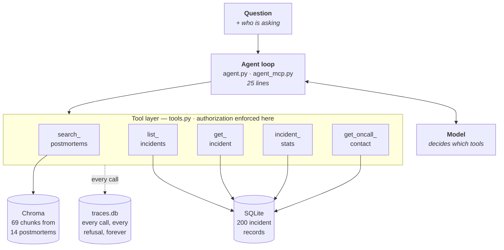
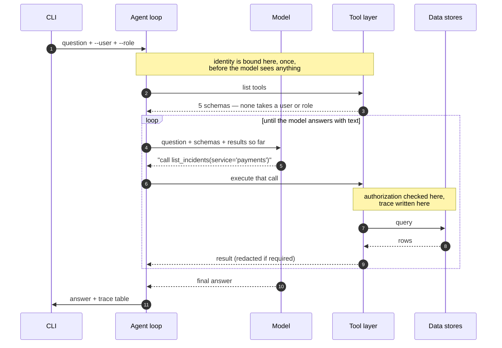
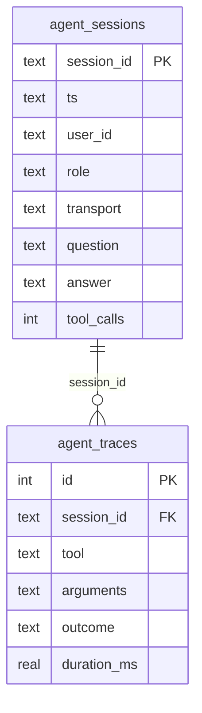

# Incident Response Agent


**Building the agent took an afternoon. Everything around it took the rest of the time, and that part is the point.**

An agent that answers questions about production incidents by reading across two kinds of data at once: 200 structured incident records and 14 written postmortems. It runs locally on synthetic data, with no cloud account and no framework.

The incident domain is a vehicle. What the repo is actually about is the harness around the model — retrieval, tool design, authorization, and tracing — which is where the engineering turned out to live.

## Quick start

Python 3.10+ and an Anthropic API key.

```bash
git clone https://github.com/pzinzuvadia/incident-response-agent.git
cd incident-response-agent

python3 -m venv .venv && source .venv/bin/activate
pip install -r requirements.txt
cp .env.example .env                    # add ANTHROPIC_API_KEY

python generate_data.py                 # 200 incidents → SQLite
python src/ingest.py                    # 14 postmortems → vector store
python src/agent.py "We're seeing payment timeouts again. Has this happened before, and who should I call?" --trace
```

First run of `ingest.py` downloads an ~80MB embedding model. Step-by-step instructions are in [Setup](#setup).

## Contents

| Section | |
|---|---|
| [What that produces](#what-that-produces) | one real run, with its trace |
| [The agent is the easy part](#the-agent-is-the-easy-part) | the argument, in four claims |
| [Why an incident assistant](#why-an-incident-assistant) | why this domain demonstrates them |
| [Who this is for](#who-this-is-for) · [What is in the repo](#what-is-in-the-repo) | orientation |
| [Architecture](#architecture) · [Two shapes of knowledge](#two-shapes-of-knowledge) · [How one question flows](#how-one-question-flows) | the system |
| [**The four decisions**](#the-four-decisions) | the core — rule, instance, and what each cost |
| [Setup](#setup) | detailed install, with expected output |
| [Four questions worth running](#four-questions-worth-running) | including the one that gets refused |
| [What broke](#what-broke) · [What still does not work](#what-still-does-not-work) | the honest part |
| [When not to build this](#when-not-to-build-this) · [What I would build next](#what-i-would-build-next) | the trade-offs |

## What that produces

```
Q [p.zinzuvadia / engineer]: We're seeing payment timeouts again.
Has this happened before, and who should I call?

Yes — this is a recurring failure mode in payments, not a new problem.

- INC-0020 (Nov 14, 2025, Sev-3) — connection pool sized for traffic from
  18 months prior, couldn't handle morning peak.
- INC-0076 (Jan 29, 2026, Sev-2) — p99 degraded to 6s. Same failure mode.
- INC-0100 (Mar 18, 2026, Sev-1) — ~4,100 checkouts failed. Third
  occurrence of the same mode.
- INC-0144 (Jun 3, 2026, Sev-2) — driver version bump changed idle timeout
  defaults, shrinking the effective pool over time.
- INC-0187 (Aug 21, 2026, Sev-2) — request queueing under sustained traffic.

From the INC-0100 postmortem: "Holding a connection while waiting on a
third party is the actual anti-pattern here. The timeout you set on an
external call is also, implicitly, a decision about how long you are
willing to hold every resource behind it."

[...]

Who to call: Payments Platform — Dana Whitfield, +1-415-555-0142

==============================================================================
TRACE
==============================================================================
#   TOOL                 USER            OUTCOME        MS  ARGUMENTS
---------------------------------------------------------------------------
1   search_postmortems   p.zinzuvadia    ok          363.6  query='payment timeouts', service='payments'
    └─ 10 chunk(s) from 4 postmortem(s)
2   list_incidents       p.zinzuvadia    ok            3.7  service='payments'
    └─ 48 incident(s)
3   get_oncall_contact   p.zinzuvadia    ok            0.1  service='payments'
    └─ Payments Platform / Dana Whitfield
---------------------------------------------------------------------------
3 tool call(s), 367.4 ms total in tools
```

Three things in that output are worth noticing before anything else.

**It found a ten-month pattern that no single document states.** Those five incidents were written months apart by different people, and none of them mention "connection pool" in a title or summary. That is a property of how the documents were chunked at ingestion, not of how the question was phrased.

**Retrieval only reached four of the five.** The fifth incident got into the answer through `list_incidents`, not through search. Giving the agent both a retrieval tool and a query tool means retrieval does not have to be perfect.

**The same question from a contractor returns the same history and no phone number.** The refusal happens inside the tool, not in the prompt. That one is the longest section of this README.

## The agent is the easy part

Send the question and the tool schemas to a model, run whatever tool it asks for, send the result back, repeat until it answers with text instead of another tool call. Here is the whole thing:

```python
for iteration in range(MAX_ITERATIONS):
    response = client.messages.create(
        model=MODEL, max_tokens=2000, system=SYSTEM_PROMPT,
        tools=TOOL_SCHEMAS, messages=messages,
    )

    if response.stop_reason != "tool_use":
        return finish(...)                       # model answered; done

    messages.append({"role": "assistant", "content": response.content})

    results = []
    for block in response.content:
        if block.type != "tool_use":
            continue
        results.append({
            "type": "tool_result",
            "tool_use_id": block.id,
            "content": run_tool(block.name, block.input, ctx),
        })

    messages.append({"role": "user", "content": results})
```

Twenty-five lines, and the least interesting file in the repo. No framework, because frameworks earn their place with checkpointing, human-in-the-loop interrupts, branching state machines and multi-agent handoff — and this is a single-turn, read-only question answerer that needs none of them. A framework here would put a layer of abstraction between you and the thing you are trying to understand.

The hard part starts the moment that loop points at data that matters.

Can it reach records this particular person should not see? When the answer is wrong, can you tell whether it retrieved badly or reasoned badly? What happens when a contractor asks the same question an engineer just asked? Three weeks from now, when someone disputes an answer, can you reconstruct what it actually did?

None of those are model problems. They are problems with everything around the model — how knowledge gets into the system, what the agent is allowed to touch, who is asking, and what gets written down. That layer is where the real work is, and it is the part most agent examples skip, because a demo does not need it and a deployment does not survive without it.

This repo is a working instance of that layer. Four decisions carry almost all of it, and each is covered in full [below](#the-four-decisions):

1. **Retrieval quality is decided at ingestion, not at query time.** By the time you are tuning a query, you are working around a decision you already made.
2. **Tool descriptions are documentation with a non-human reader.** They are read literally, including numbers mentioned in passing.
3. **Authorization belongs in the tool, not the prompt.** You cannot ask a model nicely to keep a secret.
4. **Monitoring tells you the service is up. It does not tell you what the agent did.** Every signal can be green while the answer is wrong.

The incident assistant is how those are demonstrated. The next section explains why that example was chosen.

## Why an incident assistant

The four claims need a domain where all of them are true at once, not one where three have to be invented. Incident response gives you all four for free.

The knowledge is genuinely split — incident records are structured, postmortems are prose, and neither converts into the other without losing what makes it useful. The useful questions span both halves: *"has this happened before, and who should I call"* needs the written history, the structured records, and an ownership lookup. Different people legitimately see different things, so authorization is already in the problem rather than bolted on to make a point. And an invented answer has a real cost — at 2am during an outage, a plausible wrong number is worse than no number, because someone will act on it.

One more reason, about the writing rather than the engineering: nobody needs the domain explained, which keeps attention on the architecture.

## Who this is for

- **You built an agent demo and now need it to be real** → [authorization](#3-authorization-belongs-in-the-tool-not-the-prompt) and [tracing](#4-monitoring-tells-you-the-service-is-up-it-does-not-tell-you-what-the-agent-did)
- **You are deciding between RAG and a plain query** → [the tool table](#2-tool-descriptions-are-documentation-with-a-non-human-reader) and [when not to build this](#when-not-to-build-this)
- **Your retrieval underperforms and you have been tuning queries** → [ingestion](#1-retrieval-quality-is-decided-at-ingestion-not-at-query-time)
- **You want something to break** → clone it, change the `--role` flag, reword a tool description, and watch the trace change

No Teradata, OpenAI, LangChain, or cloud account required. Python, SQLite, Chroma, and one Anthropic API key.

## What is in the repo

```
incident-response-agent/
├── generate_data.py          seeded generator → 200 incidents in SQLite
├── requirements.txt          four dependencies
├── .env.example              copy to .env, add your API key
│
├── data/
│   ├── postmortems/          14 markdown postmortems — committed
│   ├── incidents.db          generated, gitignored
│   ├── chroma/               generated, gitignored
│   └── traces.db             generated, gitignored
│
└── src/
    ├── ingest.py             postmortems → chunks → vector store
    ├── tools.py              the five tools, UserContext, redaction
    ├── trace.py              trace events, the @traced decorator, persistence
    ├── agent.py              the loop, calling tools as local functions
    ├── agent_mcp.py          the same loop, tools across a process boundary
    ├── mcp_server.py         the five tools served over MCP
    ├── check_retrieval.py    inspect retrieval alone, no model needed
    └── check_mcp.py          inspect the tool layer alone, no model needed
```

The only thing here a human wrote by hand is the 14 postmortems. The incident table, the vector store and the trace database are all generated, reproducibly, from a fixed seed.

Three things in that listing look redundant and are not.

**Two agents.** `agent.py` calls the tools as Python functions. `agent_mcp.py` reaches the same tools through an MCP server running as a separate process. They produce the same answers. The difference is where identity comes from, and that difference is the subject of the authorization section — showing it was the reason to write both.

**Two check scripts, neither of which is a test suite.** `check_retrieval.py` fires fixed queries at the vector store and prints what comes back. `check_mcp.py` connects to the MCP server and calls tools as two different users. Both run without an API key, both print rather than assert. They exist because when an agent gives a bad answer, the first question is *which layer*, and guessing is expensive.

**A separate trace database.** Incident data and operational telemetry about the system that reads it are different things with different lifecycles. `generate_data.py` recreates `incidents.db` on every run, and an audit record a dev script can wipe is not an audit record.

## Architecture

Five pieces, and only one of them is the model.



**The question arrives with an identity** — who is asking and what role they hold. That identity comes from the caller. The model never sees it and cannot set it.

**The loop** sends the question and the tool schemas to the model, gets back either a tool call or a final answer, runs the call, appends the result, and goes again until the model stops asking for tools or hits the iteration cap.

**The tool layer** is where authorization is enforced. Five tools, each checking the caller's identity before it touches data. A refusal here raises an exception rather than returning an empty result, because an agent told "denied" behaves very differently from one that quietly concludes the data does not exist.

**Two data stores** sit behind the tools — a SQLite table of incident records and a Chroma vector store of postmortem chunks. Structured facts in one, written narrative in the other.

**A trace database** underneath, recording every call: who, which tool, what arguments, what outcome, how long, and a one-line summary of what came back.

## Two shapes of knowledge

**Structured** — 200 incidents across 8 services over 12 months, in SQLite. 16 Sev-1, 46 Sev-2, 138 Sev-3. Each row carries service, severity, timestamps, resolution minutes, root cause category, owning team, and on-call contact fields. This answers *how many*, *how often*, *how long*.

**Unstructured** — 14 markdown postmortems with the sections a real one has: Summary, Timeline, Root cause, Resolution, Follow-ups, Notes. This answers *why*, and *what did we do about it*.

Only 14 of the 200 incidents have a postmortem, roughly the ratio you would find in a real organisation. That asymmetry matters: an agent searching only documents would conclude most incidents never happened.

### One deliberate choice in the schema

The contact fields live **in the same table as everything else.** They are not hidden in a separate store the agent simply has no connection string for.

Hiding data by not wiring it up is not access control — it is luck, and it stops being true the moment somebody adds a convenient join. Putting the restricted fields in the same row as the unrestricted ones forces the rule to be enforced where the data is read, which is the only place it holds.

### What is planted in the data

One pattern is planted deliberately: a connection-pool problem recurring across five payments incidents over ten months, escalating from Sev-3 to a Sev-1, with a deferred follow-up that goes unfixed through three of them.

**None of those five mention "connection pool" in a title or summary.** That is the retrieval test. A second service hits the same failure later and its postmortem notes that the payments writeups would have saved them time — which is the argument for the whole tool in one line.

```bash
python generate_data.py     # deterministic; SEED=20261005
```

## How one question flows



The line worth remembering: **identity enters at step 2 and never appears again.** Everything after that is the model choosing what to ask for, and the tool layer deciding what the caller is allowed to see. The model participates in the first decision and has no vote in the second.

Walking the same path in code, for the MCP version:

| Step | What happens | Where |
|---|---|---|
| 1 | CLI args parsed | `agent_mcp.py` |
| 2 | `INCIDENT_AGENT_USER` / `_ROLE` / `_SESSION` set, server subprocess spawned | `agent_mcp.py` |
| 3 | Server binds one `UserContext` from the environment, or refuses to start | `mcp_server.py` |
| 4 | Tool schemas returned over MCP, reshaped for the model | both |
| 5 | Model asked; returns a tool call | `agent_mcp.py` |
| 6 | Tool executed against the session's identity | `mcp_server.py` → `tools.py` |
| 7 | `@traced` records the call in memory and in `traces.db` | `trace.py` |
| 8 | Result returned to the model, minus the trace | `agent_mcp.py` |
| 9 | Repeat 5–8 until the model answers, or `MAX_ITERATIONS` | `agent_mcp.py` |
| 10 | Question and answer written to `agent_sessions` | `trace.py` |

The direct version in `agent.py` skips steps 2, 3, 4 and 8 — it constructs the `UserContext` itself and calls the Python function. Steps 6 and 7 are identical in both, which is why both agents produce the same rows in the same table.

## The four decisions

Each is stated as a rule, then as what the rule looked like here, then as what it cost.

---

### 1. Retrieval quality is decided at ingestion, not at query time

**The rule.** When retrieval underperforms, the reflex is to tune the query, raise `top_k`, or swap the embedding model. Those are the knobs nearest to hand, and they are rarely where the problem is. A chunk that lost its context when it was split cannot be found by any query, because the words that would have matched are no longer in it.

**What it looked like here.** Three decisions in `src/ingest.py` do most of the work.

*Chunk on semantic boundaries, not character counts.* Postmortems have sections. A fixed 500-character window splits a root cause across two chunks and staples half of it onto an unrelated timeline entry. Splitting on markdown headings means every chunk is a complete thought.

*Prepend context to every chunk, inside the text that gets embedded.* This is the one that matters most and the one most easily done wrong. Metadata stored alongside a chunk does not help the embedding — the vector is computed from the text. So the context goes in the text:

```python
# src/ingest.py
contextual_text = (
    f"{heading} for {incident_id} ({service}, {severity}, {date}): "
    f"{title}\n\n{body}"
)
```

What actually gets embedded, before and after:

```
WITHOUT the prefix — unfindable by anything but luck:

    The pool was again running close to its limit at peak, which we knew
    about and had not addressed. [...]


WITH the prefix — carries its own identity into the vector:

    Root cause for INC-0076 (payments, Sev-2, 2026-01-29): Payments p99
    latency degradation

    The pool was again running close to its limit at peak, which we knew
    about and had not addressed. [...]
```

*Drop what will never be retrieved.* Follow-up sections are mostly ticket IDs and owner names. They embed badly, they match noisily, and no one asks questions they answer. `SKIP_SECTIONS` removes them.

14 documents become **69 chunks**. You can inspect retrieval without spending a single model token:

```bash
python src/check_retrieval.py
```

**What it cost.** Section-based chunking means chunk sizes vary a lot — a Timeline section can be ten times the length of a Summary, and long chunks dilute their own embeddings. Two further weaknesses are listed in [what still does not work](#what-still-does-not-work); I left both in place, because the structured tool compensates for them. That is the real lesson here: retrieval does not have to be perfect when the agent has another route to the same fact.

---

### 2. Tool descriptions are documentation with a non-human reader

**The rule.** A tool description is not a comment. It is the only interface the model has at the moment it decides what to call, and it is read literally — including numbers mentioned in passing. A vague description does not produce a confused user. It produces a wrong tool call, and therefore a wrong answer, silently.

**What it looked like here.** Five tools, chosen so that no two of them answer the same question well:

| Tool | Reaches | Answers |
|---|---|---|
| `search_postmortems` | Chroma | "Has this happened before? Why?" |
| `list_incidents` | SQLite | "Which payments incidents this year?" |
| `get_incident` | SQLite | "What happened in INC-0100?" |
| `incident_stats` | SQLite | "How many Sev-1s, and the median?" |
| `get_oncall_contact` | SQLite (restricted) | "Who do I call?" |

Overlapping tools are the most common cause of bad planning. When two tools plausibly fit the same question, the model picks inconsistently between runs, and you have a non-deterministic bug that is painful to reproduce.

So the descriptions say what each tool is *not* for:

```python
{
    "name": "search_postmortems",
    "description": (
        "Search written postmortem documents by meaning, for questions "
        "about WHY something happened... Do not use this to count "
        "incidents or to compute statistics; it searches prose and "
        "cannot aggregate."
    ),
    ...
}
```

That last clause removed an entire class of wrong plans. The reverse also happened: a number left in a description quietly overrode the Python default, which is the second entry in [what broke](#what-broke).

**What it cost.** Writing descriptions this carefully is slow, and they drift out of sync with the code. There is no type checker for prose, and the failure mode is quiet — nothing errors, the agent just starts choosing differently.

---

### 3. Authorization belongs in the tool, not the prompt

This is the longest of the four, and the one most agent examples get wrong in the same way.

**The pattern that does not hold.** Put the rule in the system prompt — *"only share contact details with engineers."* It works in testing, and it is not a security control. It is an instruction to a probabilistic text generator, and it degrades under paraphrase, under long context, and under anything that looks like a legitimate reason.

You cannot ask a model nicely to keep a secret.

**The pattern that is necessary and not sufficient.** Wire the agent to a fixed allow-list of read-only tools, and nothing else. This is good practice and you should do it. But notice which question it answers: *what can this agent ever do?* It does not answer *what may this particular person see right now?* If every user of the agent reaches the same tools with the same scope, the allow-list has not given you access control. It has given you a smaller blast radius, which is a different and lesser thing.

**What this repo does instead.** Every tool takes a `UserContext` as its first argument, supplied by the caller, never by the model, and never visible to the model:

```python
@dataclass
class UserContext:
    """Who is asking. Supplied by the caller, never by the model."""
    user_id: str
    role: str

    @property
    def may_see_contacts(self) -> bool:
        return self.role in ROLES_WITH_CONTACT_ACCESS


def _redact(row: dict, ctx: UserContext) -> dict:
    """Single point where the contact-field rule is applied."""
    if ctx.may_see_contacts:
        return row
    return {k: v for k, v in row.items() if k not in RESTRICTED_FIELDS}
```

Two properties do the work. The check lives at the **data layer**, so a new tool that reads the incidents table inherits redaction rather than having to remember the rule — gating `get_oncall_contact` while leaving contact columns in the rows returned by `list_incidents` would be theatre. And a refusal **raises** rather than returning empty, because a refusal is an event worth recording, and because an agent told "denied" behaves very differently from one that silently concludes the data does not exist.

**Where MCP makes the problem real.** Locally, passing a `UserContext` is trivial — the loop and the tool are the same program, so of course you can pass it safely. The hard version only appears once the tools run somewhere else, which is where every real system lives.

MCP describes tools, arguments and results. It has no concept of a caller. The server receives *"call list_incidents with service=payments"*, not *"...on behalf of this authenticated person."* The protocol is silent on identity, and that silence is easy to fill badly:

- **The wrong answer:** add `user` and `role` to each tool's input schema. Now the model supplies them, and a field the model fills is a field the model can fill with anything.
- **What `mcp_server.py` does:** identity is bound when the server process starts, from the environment the client supplied, before any tool is listed and long before the model sees anything. One `UserContext` per session. It appears in no schema, so the model cannot read it, set it, or argue with it. If the environment is missing, the server refuses to start.

That is the same shape as a gateway that validates a token and hands the backend an already-authenticated principal. The backend does not ask the request who it is.

```bash
python src/check_mcp.py
```

```
SESSION: p.zinzuvadia / engineer        SESSION: ext.contractor / contractor
  tools advertised: 5                     tools advertised: 5
  identity fields exposed: none           identity fields exposed: none

  list_incidents     → contacts: True     list_incidents     → contacts: False
  get_oncall_contact → ok                 get_oncall_contact → denied
```

Identical tool surface. Different data. The difference is not in the schema, the prompt, or anything the model can reach.

**What it cost.** The MCP path is a subprocess to manage, an async client, a round trip for tool discovery, and a failure mode where the server dies and the agent has no tools at all. Locally that buys nothing — these could stay Python functions. It is here because the authorization argument is weak until the tools are genuinely somewhere else.

---

### 4. Monitoring tells you the service is up. It does not tell you what the agent did.

**The rule.** Standard observability answers: did it respond, how fast, did it error. For an agent, every one of those can be green while the answer is wrong. The question you actually need answered is *why did it say that*, and nothing in a latency dashboard can answer it.

**What it looked like here.** Every tool call is wrapped by a decorator that records it:

```python
@dataclass
class TraceEvent:
    tool: str
    user: str
    role: str
    arguments: dict          # ← the field that earns its place
    duration_ms: float
    outcome: str             # "ok" | "denied" | "error"
    result_summary: str
```

`arguments` is in there deliberately. Knowing `list_incidents` was called tells you almost nothing. Knowing it was called with `since='2024-10-01'` tells you exactly what went wrong — which is a real bug from this repo, covered in [what broke](#what-broke).

Add `--trace` to any run to see it. But printing only helps for a run you are watching, so every event is also written to `data/traces.db`:



Two tables because the grain differs: one row per question, one row per tool call. Join them and you have the whole picture.

```sql
-- every refusal this system has ever issued, and what was asked
SELECT s.ts, s.user_id, s.question, t.tool, t.arguments
FROM   agent_sessions s JOIN agent_traces t USING (session_id)
WHERE  t.outcome = 'denied'
ORDER  BY s.ts DESC;
```

**One asymmetry worth naming.** The trace rows are written by the tool layer, at the point where data is actually reached. The session row is written by the agent loop, afterwards, by the component being observed. That is a weaker position — if the loop crashes mid-question, the tool calls are already on disk and the session row never appears.

That is deliberate. If the two ever disagree, believe the trace rows. Orphaned trace rows with no session row are not a logging bug; they are the logging telling you a run died partway through.

**What it cost.** A write on every tool call, and a decision about what to do when the trace store is unavailable. Here the write is best-effort and prints to stderr on failure, because failing a user's question over a failed audit write is the wrong trade in this system. Where the audit record is a compliance requirement it is the right trade, and that line would raise instead.

## Setup

The quick start at the top is the same thing without explanation. This version says what each step does and what you should see, so you can tell which one failed.

### Prerequisites

**Python 3.10 or later.** The MCP SDK requires it, and `agent_mcp.py` uses `tuple[str, Trace]` annotations that are a syntax error on 3.9.

```bash
python3 --version
```

**An Anthropic API key.** Get one at [console.anthropic.com](https://console.anthropic.com). Running the agent costs a fraction of a cent per question. The two inspection scripts cost nothing — they do not call a model.

**About 200MB of disk.** Most of that is the embedding model Chroma downloads on first use.

### 1. Clone and create a virtual environment

```bash
git clone https://github.com/pzinzuvadia/incident-response-agent.git
cd incident-response-agent

python3 -m venv .venv
source .venv/bin/activate          # Windows: .venv\Scripts\activate
```

Your prompt should now be prefixed with `(.venv)`.

### 2. Install dependencies

```bash
pip install -r requirements.txt
```

Four packages: `anthropic`, `chromadb`, `python-dotenv`, `mcp`. Chroma pulls in a fair amount transitively, so this takes a minute or two.

### 3. Add your API key

```bash
cp .env.example .env
```

Open `.env` and set:

```
ANTHROPIC_API_KEY=sk-ant-...
```

`.env` is gitignored. The optional `MODEL` variable overrides the default model if you want to compare behaviour across models — worth doing, because tool-choice behaviour differs more than you would expect.

### 4. Generate the incident data

```bash
python generate_data.py
```

```
Wrote 200 incidents to .../data/incidents.db
Planted payments cluster: INC-0020, INC-0076, INC-0100, INC-0144, INC-0187
```

Seeded, so you get exactly the same 200 incidents I did. The second line names the recurring failure the retrieval examples depend on.

The 14 postmortems are already in `data/postmortems/` — they are committed, not generated.

### 5. Build the vector store

```bash
python src/ingest.py
```

```
Indexed 69 chunks from 14 postmortems
Vector store: .../data/chroma
Chunks per section type: Notes=14, Resolution=14, Root cause=14, Summary=14, Timeline=13
```

**First run downloads an ~80MB embedding model** (all-MiniLM-L6-v2) and will sit silently for a minute or two while it does. It is cached afterwards.

Note the asymmetry in that last line: one postmortem has no Timeline section, and Follow-ups sections are skipped entirely at ingestion. Both are deliberate.

### 6. Check the layers before asking anything

Neither of these needs an API key. Both print rather than assert — they are for looking, not for passing.

```bash
python src/check_retrieval.py     # is retrieval finding the right chunks?
python src/check_mcp.py           # is the tool layer enforcing the right rules?
```

The first fires six fixed queries at the vector store and prints the top hits with their distances — **lower distance is closer**. The second starts the MCP server twice, once as an engineer and once as a contractor, and calls three tools as each.

If the agent later gives a bad answer, these two tell you which layer to blame.

### 7. Ask it something

```bash
python src/agent.py "How many Sev-1 incidents last quarter, and what was the median resolution time?" --trace
```

| Flag | Default | What it does |
|---|---|---|
| `--user` | `p.zinzuvadia` | Caller's user id, recorded in the trace |
| `--role` | `engineer` | `engineer`, `incident_commander`, or `contractor` |
| `--trace` | off | Print the tool-call trace after the answer |
| `--verbose` | off | Print each tool call as it happens |

The MCP version takes the same flags:

```bash
python src/agent_mcp.py "We're seeing payment timeouts again. Has this happened before, and who should I call?" --user ext.contractor --role contractor --trace
```

### 8. Look at what it did

```bash
sqlite3 data/traces.db "SELECT session_id, transport, role, tool_calls, question FROM agent_sessions ORDER BY ts DESC LIMIT 5"
```

Every run you have made is in there, including the refusals.

### If something goes wrong

| Symptom | Cause |
|---|---|
| `SyntaxError` on `tuple[str, Trace]` | Python < 3.10 |
| `chromadb` import fails | Virtual environment not activated |
| `authentication_error` from the API | `.env` missing, misnamed, or key not saved |
| `credit balance is too low` | Billing not set up on the API account |
| `get_collection: postmortems does not exist` | `src/ingest.py` not run yet |
| `no such table: incidents` | `generate_data.py` not run yet |
| `ingest.py` hangs on first run | Downloading the embedding model — wait |
| MCP server exits with code 2 | Identity env vars missing; you launched `mcp_server.py` directly instead of through `agent_mcp.py` |

To start over, delete the generated artifacts and re-run steps 4 and 5. Nothing in `data/` is precious except `postmortems/`:

```bash
rm -rf data/incidents.db data/chroma data/traces.db
```

## Four questions worth running

The cross-source question is [at the top](#what-that-produces). These are the other three, each showing something different.

### One tool, when one tool is right

```bash
python src/agent.py "How many Sev-1 incidents last quarter, and what was the median resolution time?" --trace
```

```
There were 5 Sev-1 incidents last quarter (July 1 – September 30, 2026),
with a median resolution time of 90 minutes.

For context, the mean was 104 minutes, and the longest took 207 minutes.

==============================================================================
TRACE
==============================================================================
#   TOOL                 USER            OUTCOME        MS  ARGUMENTS
---------------------------------------------------------------------------
1   incident_stats       p.zinzuvadia    ok            0.8  severity='Sev-1', since='2026-07-01', until='2026-09-30'
    └─ n=5, median=90min
---------------------------------------------------------------------------
1 tool call(s), 0.8 ms total in tools
```

Counting and medians are query operations. The agent did not search a single document, and it should not have — dressing an aggregate up as semantic search makes it slower and less correct.

Note the arguments: the model resolved "last quarter" to a real date range. It did not always. That is the first entry in [what broke](#what-broke).

This is also the case that makes the trade-off concrete. If this is the question you ask every Monday, do not build an agent. Build a dashboard.

### The same question, from two different people

This is the one that matters.

```bash
python src/agent_mcp.py "We're seeing payment timeouts again. Has this happened before, and who should I call?" --user p.zinzuvadia --role engineer --trace

python src/agent_mcp.py "We're seeing payment timeouts again. Has this happened before, and who should I call?" --user ext.contractor --role contractor --trace
```

| | engineer | contractor |
|---|---|---|
| `search_postmortems` | ok — 10 chunks, 4 postmortems | ok — 10 chunks, 4 postmortems |
| `list_incidents` | ok — 48 incidents | ok — 48 incidents |
| `get_oncall_contact` | ok — Dana Whitfield | **denied** |
| Incident history in the answer | full five-incident pattern | full five-incident pattern |
| Contact in the answer | name and phone number | *"I'm not authorized to provide on-call contact information. You'll need to ask someone with appropriate access for the Payments Platform team's on-call contact."* |

The contractor is not locked out of the system. They lose one field. They keep the entire incident history, the root-cause analysis, and the name of the owning team — which is what makes this access control rather than a wall.

And the agent says so plainly instead of inventing a plausible name, because the tool raised rather than returning empty.

One honest note about reading this comparison. The prose differs between the two runs beyond the contact line — different wording, different ordering, a slightly different selection of incidents cited. That is planning non-determinism, not a permissions effect. What differs *because of permissions* is exactly one tool outcome and one field. Read the trace, not the paragraphs.

### Refusing to answer

```bash
python src/agent.py "What did these outages cost us in lost revenue?" --trace
```

```
I don't have access to revenue or financial data through the incident
tools available to me. The tools I can use provide incident records,
postmortem write-ups, on-call contact information, and statistics about
incident frequency and resolution times.

[...]

If you'd like, I can help you identify which incidents occurred during a
specific time period, how long services were down, or which services were
affected — information that might be useful for a revenue impact analysis.

==============================================================================
TRACE
==============================================================================
(no tool calls)
```

There is no revenue data anywhere in this system. The agent could have called `incident_stats`, collected durations, and produced an estimate that looked authoritative. It called nothing.

That comes from one line in the system prompt — *never fill a gap with what you know about software in general* — combined with tool descriptions narrow enough that none of them plausibly fits. During an incident, a confident wrong number is worse than no number, because someone will put it in an email.

### Phrasing changes the plan more than permissions do

A finding from building this, included because it is the kind of thing that looks like a bug and is not.

```bash
python src/agent_mcp.py "Payment timeouts again, who do I call?" --user ext.contractor --role contractor --trace
# → 1 tool call: get_oncall_contact, denied

python src/agent_mcp.py "Payment timeouts again, who do I call?" --user p.zinzuvadia --role engineer --trace
# → 1 tool call: get_oncall_contact, ok
```

The short phrasing gets one tool call. The longer phrasing at the top of this README gets three. I initially read this as a bug — a refusal causing the agent to abandon the rest of the question — and one controlled run disproved it: the engineer, who is refused nothing, behaves identically. The variable was the wording, not the role. *"Who do I call"* is one explicit question; *"has this happened before, and who should I call"* is two.

Worth noticing what made that diagnosis cheap. Comparing two English paragraphs would have told me nothing. Comparing two traces took one run.

## What broke

Three bugs the trace found and nothing else would have.

**The model invented a date range.** Asked about "last quarter", it resolved it to `2024-10-01` → `2024-12-31` and returned zero results. A model has no reliable sense of today's date, and nothing in the prompt had told it. Standard logs showed a successful call returning an empty set — technically correct, completely unhelpful. The trace showed the arguments, which is the whole difference.

```python
# the fix, in agent.py
SYSTEM_PROMPT = f"Today's date is {date.today().isoformat()}. ..."
```

**A default I changed had no effect.** I raised the `limit` default in `list_incidents` from 20 to 50, and the agent kept returning 20 rows — occasionally missing INC-0100, the Sev-1 that makes the payments pattern obvious. The model was passing `limit=20` explicitly, having read the number out of the tool's description text. The description was the live configuration. The Python default was decoration.

**Planning is non-deterministic, and it mimics other bugs.** The same question produces different tool orders and sometimes different tool counts across runs. Usually every ordering is correct, which makes it easy to miss — and means any test asserting an exact call sequence will flake. It also produces false bug reports: see [the phrasing investigation](#phrasing-changes-the-plan-more-than-permissions-do) above, where two runs that differed only in wording looked like an authorization failure for about ten minutes.

## What still does not work

Left in place deliberately, because the honest version is more useful than a tidied one.

**Resolution sections retrieve poorly.** They are terse and procedural, so questions phrased as "how was this fixed" underperform compared to "why did this happen". More context in the chunk prefix would help; so would writing better postmortems.

**Payments dominates the corpus.** Five of fourteen postmortems are payments incidents, because that is where the planted pattern lives. Payments chunks surface slightly too eagerly for generic questions. Real corpora are skewed too, just not usually on purpose.

**Retrieval reaches four of the five planted incidents, not five.** The fifth arrives through `list_incidents`. This is the system working as designed rather than a defect — but it is worth saying out loud, because "retrieval found everything" would be a nicer claim and an untrue one.

**The role model is crude.** Two roles, one restricted field set, hardcoded in `tools.py`. A real system reads this from the same identity provider that governs everything else, and the agent does not get its own parallel permission model. Mine does, which is fine for a demonstration and wrong for a deployment.

**Nothing verifies answer quality.** The two inspection scripts check that retrieval returns sensible chunks and that the tool layer enforces its rules. Neither checks whether the final prose is correct. An agent can call exactly the right tool and still misread the number it got back. Closing that gap needs a model-graded eval, which is a different piece of work.

## When not to build this

An agent is the wrong answer more often than the current discourse suggests.

**If you know the questions in advance, build a dashboard.** "Sev-1 count by service this quarter" is a SQL query and a chart. Faster, cheaper, deterministic, correct every time, and it cannot hallucinate. Agents earn their cost when the question space is open — when the useful question is the one nobody anticipated at design time.

**If all your knowledge is already structured, you want a query interface, not retrieval.** Text-to-SQL over a clean schema beats this architecture on accuracy and latency. The pattern here pays off specifically when answers require crossing structured records and written prose, which no single query language spans.

**If you cannot enforce authorization at the data boundary, stop.** If the only thing between a user and data they should not see is a sentence in a prompt, you do not have a prototype. You have a liability with a good demo.

**What it costs when it is the right answer.** A few hundred milliseconds to several seconds per question. A model call per tool round trip. An execution path that is non-deterministic and genuinely harder to test than a query.

## What I would build next

In the order I would do it.

**Deployment.** This runs on a laptop. Running it as a service means an HTTP transport instead of stdio, real identity from a token rather than an environment variable, the trace store somewhere durable and shared, and a concurrency model — the MCP server here holds one identity for its whole lifetime, which is correct for a CLI and wrong for a service. That last one is the interesting problem: per-request identity binding instead of per-process.

**A model-graded eval.** Fixed questions, expected answers, a second model judging whether the response matches. It brings its own problems — now you are trusting a grader — but it closes the gap the inspection scripts leave open.

**Live authorization rather than bound-at-start.** Right now identity is fixed when the server process starts, so membership changes do not take effect until it restarts. The production version of this is token lifetime: if a role is revoked, how long until the agent stops honouring it? I hit the same gap on an enterprise MCP deployment at SAP, where group changes took up to an hour to propagate. It never surfaces in a demo and always surfaces in an audit.

**Incremental ingestion.** `ingest.py` rebuilds the whole collection every run. Fine for 14 documents, absurd for 14,000. Real corpora need change detection, re-embedding only what moved, and a story for deletions.

## The pattern, without the incidents

None of this is really about incident response.

The shape is: knowledge split across structured records and written documents, questions that span both, and different people who should see different subsets of it. Wherever that holds, the same four pieces apply — retrieval with the real decisions made at ingestion, tools for what retrieval cannot do, authorization at the tool boundary and per user rather than per agent, and a durable record of what was actually called.

Claims history plus policy documents plus adjuster permissions. Patient records plus clinical notes plus role-based access. Customer accounts plus support transcripts plus tiered agent visibility.

Change the domain and the data. The engineering does not move.

---

*Built by [Priyansh Zinzuvadia](https://www.linkedin.com/in/pszinzuvadia/). The longer argument is on [Medium](#MEDIUM).*
